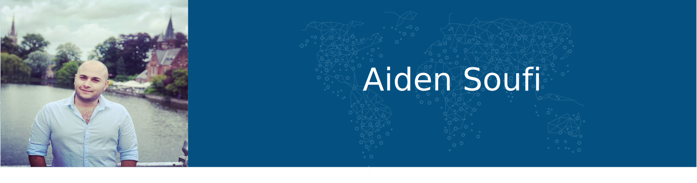

 

## Contact Information

Adress: Heusden 9070, East Flanders, Belgium

Email: soufi.aiden@gmail.com

Website: https://soufieddin.github.io/

## Social

  linkedin: https://www.linkedin.com/in/aiden-soufi-a17ba0191/

  github: https://github.com/soufieddin
## About

## Skills

- HTML5
- CSS3
- SASS
- Javascript
- NodeJS
- ExpressJS
- SQL
- Git
- Eleventy
## Experience

https://www.instructables.com/MixCheers/

## Education

- Master degree in dentistery from Kharkiv National Medical University in Ukraine
- Finished 1st year of bachelor in new multimedia technologies from Howest Kortrijk Belgium
- Busy in 1st year of Associate Degree in programming from Artevelde university of applied sciences Gent Belgium
## Languages

- Russian
- English
- Dutch

## Interests

- Coding
- Video games
- Reading
## Github stats

